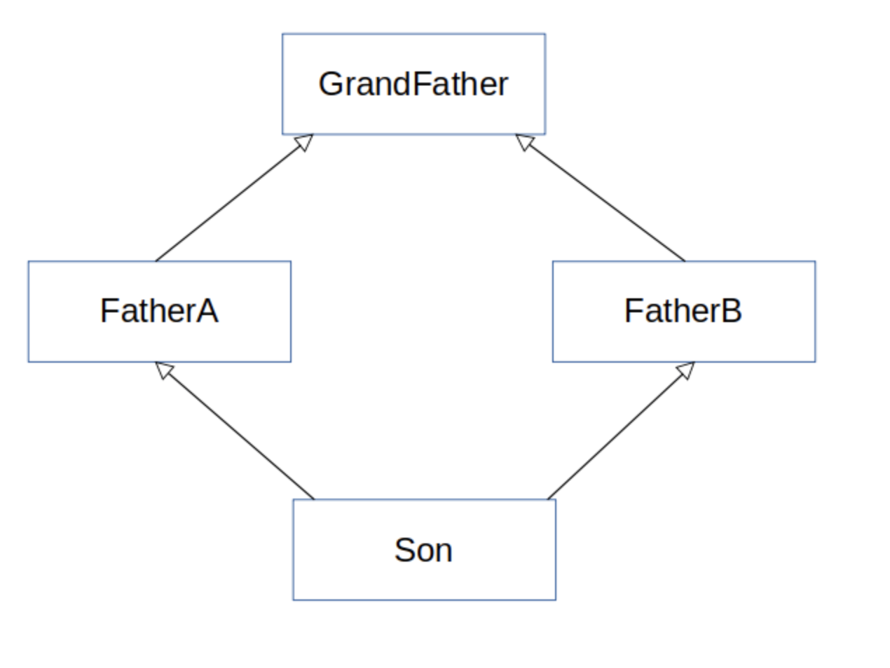

# Chapter13

## 디폴트 메서드

인터페이스를 구현하는 클래스는 인터페이스에서 정의하는 모든 메서드 구현을 제공하거나 아니면 슈퍼클래스의 구현을 상속받아야한다.

- 라이브러리 설계자 입장에서 인터페이스에 새로운 메서드를 추가하는 등 인터페이스를 바꾸고 싶을 때는 문제가 발생한다.

    ⇒ 인터페이스를 바꾸면 이전에 해당 인터페이스를 구현했던 모든 클래스의 구현도 고쳐야 하기 때문

**자바8**에서는 이러한 문제를 해결하는 새로운 기능을 제공한다.

자바8에서 기본 구현을 포함하는 인터페이스를 정의하는 두 가지 방법을 제공

1. 인터페이스 내부에 **정적 메서드**를 사용

    ⇒ static 메서드는 재정의가 불가능

    ⇒ 반드시 클래스 명으로 메서드를 호출해야한다.

2. 인터페이스의 기본 구현을 제공할 수 있도록 **디폴트 메서드** 기능을 사용

⇒ 디폴트 메서드를 사용하면 기존의 코드 구현을 바꾸도록 강요하지 않으면서도 인터페이스를 바꿀 수 있다.

- 1장에서 나온 예제

```java
default void sort(Comparator<? super E> c){
	Collections.sort(this, c);
}
```

`default` 키워드는 해당 메서드가 디폴트 메서드임을 가리킨다.

## 1. 변화하는 API

이미 릴리스된 인터페이스를 고치게 되면 문제가 발생한다.

Resizable 인터페이스 초기 버전은 다음과 같은 메서드를 포함

```java
public interface Resizable extends Drawable {
    int getWidth();
    int getHeight();
    void setWidth(int width);
    void setHeight(int height);
    void setAbsoluteSize(int width, int height);
}
```

Resizable 인터페이스에 `void setRelativeSize(int wFactor, int hFactor)`를 추가로 구현해야 할 일이 생겼다. ⇒ 컴파일 에러

- 기존에 Resizable을 고치면 몇가지 문제가 발생
    - Resizable을 구현하는 모든 클래스는 setRelativeSize를 구현해야한다.
    - 공개된 API를 고치면 기존 버전과의 호환성 문제가 발생

    ⇒  API를 바꿀 수 있는 몇가지 대안이 있지만 완벽한 해결책이 될 수 없다. 

    - 자신만의 별도의 API를 만들어 예전 버전과  새로운 버전을 직접 관리
    - 사용자가 예전 버전과 새로운 버전 두가지 라이브러리를 모두 사용

- [ ]  디폴트 메서드로 이 모든 문제들을 해결할 수 있다.

    ⇒ 새롭게 바뀐 인터페이스에서 자동으로 기본 구현을 제공하므로 기존 코드를 고치지 않아도 된다.

> 바이너리 호환성, 소스 호환성, 동장 호환성

- **바이너리 호환성**

    뭔가를 바꾼 이후에도 에러 없이 기존 바이너리가 실행될 수 있는 상황 

    (ex ) 인터페이스에 메서드를 추가했을 때 추가된 메서드를 호출하지 않는 한 문제가 일어나지 않음

- **소스 호환성**

    코드를 고쳐도 기존 프로그램을 성공적으로 재컴파일 할 수 있음을 의미

    (ex) 인터페이스에 메서드를 추가하면 소스 호환성이 아니다.

    추가한 메서드를 구현하도록 클래스를 고치면 소스 호환성

- **동장 호환성**

    코드를 바꾼 다음에도 같은 입력 값이 주어지면 프로그램은 같은 동작을 실행

    (ex) 인터페이스에 메서드를 추가하더라도 프로그램에서 추가된 메서드를 호출할 일이 없을 때 동작 호환성은 유지된다.

## 2. 디폴트 메서드란 무엇인가?

자바8에서 호환성을 유지하면서 API를 바꿀 수 있도록 디폴트 메서드를 제공

- 디폴트 메서드는 default라는 키워드로 시작

```java
public interface Sized{
	int size();  // 추상 메서드
	default boolean isEmpty(){  //디폴트 메서드
		return size() == 0;
	}
}
```

- [ ]  함수형 인터페이스는 오직 하나의 추상 메서드만 포함하는 것

    ⇒ 디폴트 메서드는 추상 메서드에 해당하지 않는다.

## 3. 디폴트 메서드 활용 패턴

### 선택형 메서드

인터페이스를 구현할 때 필요없는 추상 메서드에 대해서 반드니 구현을 해줬어야 하므로 빈 구현을 했었다.

⇒ 디폴트 메서드를 통해 인터페이스에서 구현을 해준다면 쓸데없이 빈 구현 코드가 사라지게 된다.

### 동작 다중 상속

디폴트 메서드를 이용하면 기존에는 불가능했던 동작 다중 상속 기능도 구현 할 수 있다.

⇒ 자바에서 클래스는 한 개의 다른 클래스만 상속을 받을 수 있지만 인터페이스는 여러 개 구현할 수 있다.

### 다중 상속 형식

```java
public class ArrayList<E> extends AbstractList<E> 
	implements List<E>, RandomAccess, Clonealbe, Serializable{
}
```

ArrayList는 한개의 클래스를 상속 받고 여섯 개의 인터페이스를 구현한다.

⇒ 인터페이스가 구현을 포함 할 수 있으므로 클래스는 여러 인터페이스에서 동작을 상속받을 수 있다.

### 기능이 중복되지 않는 최소의 인터페이스

```java
public interface Rotatable{
	void setRotationAngle(int angleInDegrees);
	int getRotationAngle();
	default void rotateBy(int angleInDegrees){
		setRotationAngle((getRotationAngle() + angleInDegrees)%360);
	}
}
```

Rotatable을 구현하는 모든 클래스는 setRotationAngle과 getRotationAngle의 구현을 해야한다.

하지만 rotateBy는 기본 구현이 제공되므로 따로 구현을 제공하지 않아도 된다.

### 인터페이스 조합

인터페이스를 이용하여 다양한 클래스를 구현할 수 있다.

---

### 옳지 못한 상속

상속으로 코드 재사용 문제를 모두 해결할 수 있는 것은 아니다.

(ex) 한 개의 메서드를 재사용하려고 100개의 메서드와 필드가 정의되어 있는 클래스를 상속받는 것은 좋은 생각이 아니다.

멤버 변수를 이용하여 클래스에서 필요한 메서드를 직접 호출하는 것이 좋다.

## 4. 해석 규칙

자바8에는 디폴트 메서드가 추가되었으므로 같은 시그니처를 갖는 디폴트 메서드를 상속 받는 상황이 생길 수 있다.

(자주 일어 나는 일은 아니지만 해결 할 수 있는 규칙이 필요)

```java
public interface A{
			default void hello(){
					System.out.println("Hello from A");
			}
}

public interface B{
    	default void hello(){
	    		System.out.println("Hello from B");
    	}
}

public class C implements B, A{
    	public static void main(String[] args){
					new C().hello();
    	}
}
```

### 알아야 할 세 가지 해결 규칙

1. 클래스가 항상 이긴다. 클래스나 슈퍼클래스에서 정의한 메서드가 디폴트 메서드보다 우선권을 가진다.

2. 1번 규칙 이외의 상황에서 서브인터페이스가 이긴다.

    상속관계를 갖는 인터페이스에서 같은 시그니처를 갖는 메서드를 정의할 때에는 서브 인터페이스가 이긴다.

    (ex) B가 A를 상속 받는다면 B가 A를 이긴다

3. 여전히 디폴트 메서드의 우선순위가 결정되지 않았다면 여러 인터페이스를 상속받는 클래스가 명시적으로 디폴트 메서드를 오버라이드하고 호출해야한다.
    - 자바에서는 X.super.m(...) 형태의 새로운 문법을 제공한다.

    ```java
    public class C implements B,A {
        public static void main(String[] args) {
            new C().hello();
        }
        public void hello(){
            B.super.hello();
        }
    }
    ```

> 다이아몬드 문제



 

### (ex)

GrandFather만 `void hello`가 있다면 Son을 main클래스에서 상속받고 있을 때 GrandFather에 `void hello`가 실행

FatherA에도 `void hello`가 있다면 FatherA에 void hello가 실행

FatherA와 FatherB에 `void hello`가 모두 있다면 명시적으로 호출